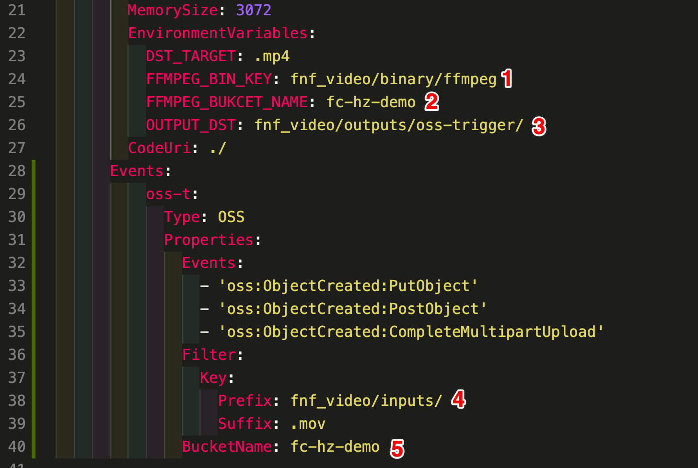

## 简介

假设您是对短视频进行简单的处理， 架构方案图如下：


如上图所示， 用户上传一个视频到 OSS, OSS 触发器自动触发函数执行， 函数调用 FFmpeg 进行视频转码， 并且将转码后的视频保存回 OSS。

## 操作部署

#### 1. clone 该工程

```bash
git clone http://gitlab.alibaba-inc.com/ls147258/fc-video-process.git
```

进入 `simple-video-processing` 目录

复制 `.env_example` 文件为 `.env`, 并且修改 `.env` 中的信息为自己的信息

#### 2. 安装并且配置最新版本的 [fun](https://help.aliyun.com/document_detail/64204.html)

[fun 安装手册](https://github.com/alibaba/funcraft/blob/master/docs/usage/installation-zh.md)

在使用前，我们需要先进行配置，通过键入 fun config，然后按照提示，依次配置 Account ID、Access Key Id、Secret Access Key、 Default Region Name 即可

#### 3. 执行部署命令

- 先在响应的 region 指定的目录上传 FFmpeg 可执行文件到 OSS 上， 比如该示例是在杭州名为 fc-hz-demo 的 bucket 的 fnf_video/binary/ffmpeg 目录中

> FFmpeg 可执行文件可以直接使用 video-processing/.fun/nas/auto-default/video-demo/ffmpeg, 也可以从 [https://www.johnvansickle.com/ffmpeg/](https://www.johnvansickle.com/ffmpeg/) 下载最新版。

- 更新 template.yml 文件， 如下图所示：
    
    > 其中 2 必须更改，因为 bucket 名字是唯一的， 其他可以参考，不用修改

- 执行 `fun deploy`