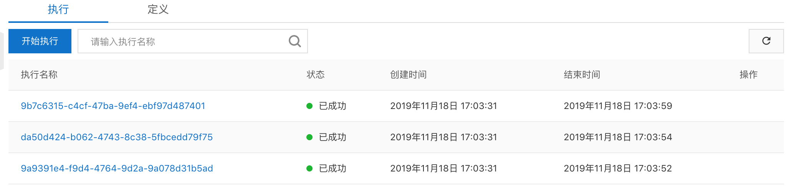

## 简介

对全功能视频处理系统(FnF + FC) 进行压测

## 开启压测

``` bash
python pressure_test.py 3

```

其中参数 3 为并发执行 FnF + FC 视频转码的个数

## 示意图

**FnF 流程同时启动 excution**


**所有的 FnF 流程都成功执行**



**并发转码的结果**


## 性能优异

**函数计算 + 函数工作流  Serverless 方案转码性能表**

实验视频为是 89s 的 mov 文件 4K 视频: [4K.mov](https://fc-hz-demo.oss-cn-hangzhou.aliyuncs.com/fnf_video/inputs/4K.mov)，云服务进行 mov -> mp4 普通转码需要消耗的时间为 188s， 将这个参考时间记为 T

|  视频切片时间   | FC转码耗时 | 性能加速百分比 |
|  ----  | ----  | ----  |
|  45s |  130s |  144.6%
|  25s |  100s  |  188%
|  15s |  70s |  268.6%
|  10s |  45s |  417.8%
|  5s  |  35s  |  537.1%

> 性能加速百分比 = T / FC转码耗时

从上表可以看出，设置的视频切片时间越短， 视频转码时间越短， 函数计算可以自动瞬时调度出更多的计算资源来一起完成这个视频的转码, 转码性能优异。